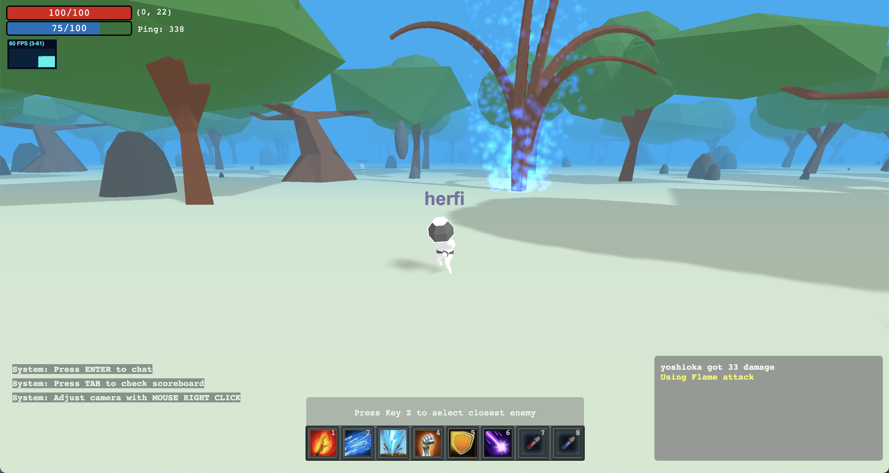

# Herfi

Herfi is a 3D multiplayer game prototype/technical demo written in Clojure and ClojureScript. 

Big thanks to **infinitelives/px3d** and **PlayCanvas** projects, I couldn't have managed to build this project without them. This project is a fork of **px3d**, and I tried to mimic the ECS (Entity Component System) of PlayCanvas.

## Screenshot

## Prerequisites

You will need [Leiningen][1] 2.0 or above installed.

[1]: https://github.com/technomancy/leiningen

## Running
`npm install`

`npm run watch`

To start a web server for the application, run:

    lein run 

Then open: http://localhost:3000

## License

Copyright © 2022 Ertuğrul Çetin
